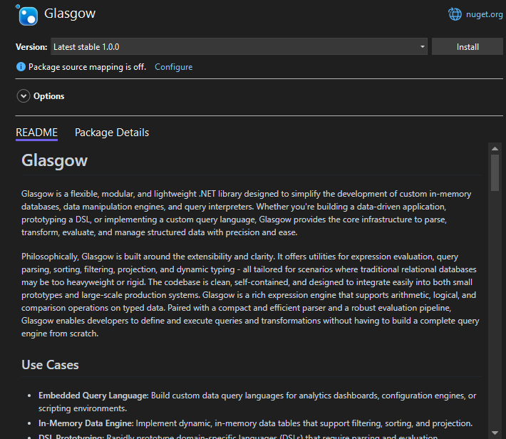

# Glasgow

Glasgow is a flexible, modular, and lightweight .NET library designed to simplify the development of custom in-memory databases, data manipulation engines, and query interpreters. Whether you're building a data-driven application, prototyping a DSL, or implementing a custom query language, Glasgow provides the core infrastructure to parse, transform, evaluate, and manage structured data with precision and ease.

Philosophically, Glasgow is built around the extensibility and clarity. It offers utilities for expression evaluation, query parsing, sorting, filtering, projection, and dynamic typing - all tailored for scenarios where traditional relational databases may be too heavyweight or rigid. The codebase is clean, self-contained, and designed to integrate easily into both small prototypes and large-scale production systems. Glasgow is a rich expression engine that supports arithmetic, logical, and comparison operations on typed data. Paired with a compact and efficient parser and a robust evaluation pipeline, Glasgow enables developers to define and execute queries and transformations without having to build a complete query engine from scratch.

## Use Cases

- **Embedded Query Language**: Build custom data query languages for analytics dashboards, configuration engines, or scripting environments.
- **In-Memory Data Engine**: Implement dynamic, in-memory data tables that support filtering, sorting, and projection.
- **DSL Prototyping**: Rapidly prototype domain-specific languages (DSLs) that require parsing and evaluation capabilities.
- **ETL Pipelines**: Integrate Glasgow into Extract-Transform-Load pipelines for structured data filtering and transformation.

## Installation

Glasgow can be easily installed into your .NET project using NuGet Package Manager.

### Installation via NuGet Package Manager

The simplest way to add Glasgow to your project is through NuGet.

<p align="center">
    
</p>

### Using the .NET CLI

Open your terminal or command prompt, navigate to your project's directory, and run the following command:

```bash
dotnet add package Glasgow --version 1.0.0
```

### Using Visual Studio

1. Open your project in Visual Studio.
2. Right-click on your project in the Solution Explorer and select "Manage NuGet Packages...".
3. In the "Browse" tab, search for `Glasgow`.
4. Select the `Glasgow` package and click "Install".
5. Confirm the installation when prompted.

### Using PowerShell (Package Manager Console in Visual Studio)

If you're in Visual Studio, you can also use the Package Manager Console:

1. Go to `Tools` > `NuGet Package Manager` > `Package Manager Console`.
2. In the console, run the following command:

    ```powershell
    Install-Package Glasgow -Version 1.0.0
    ```

3. After installation, you can verify that the package is correctly referenced in your project file (e.g., `.csproj`). Look for an `<PackageReference>` entry similar to this:

```xml
<Project Sdk="Microsoft.NET.Sdk">

  <PropertyGroup>
    <OutputType>Exe</OutputType>
    <TargetFramework>net8.0</TargetFramework>
    <ImplicitUsings>enable</ImplicitUsings>
    <Nullable>enable</Nullable>
  </PropertyGroup>

  <ItemGroup>
    <PackageReference Include="Glasgow" Version="1.0.0" />
  </ItemGroup>

</Project>
```

## Example Usage

### Loading and Saving Database to File

These examples demonstrate how to persist a GlasgowDB instance to disk and retrieve it later. The database is encrypted using a password for secure storage. This allows you to save the entire in-memory database state and reload it later without reinitializing or repopulating data manually.

```csharp
GlasgowDB db = new GlasgowDB(); // Create database instance
DatabaseIO.SaveToFile(          // Save the database instance to file
    db,
    "database.glasgow",
    "this_is_your_password"
);
```

```csharp
// Load database from file with specified file name and password
GlasgowDB db = DatabaseIO.LoadFromFile(
    "database.glasgow",
    "this_is_your_password"
);
```

### Creating Database

This snippet shows how to initialize a new GlasgowDB instance and define tables within it. Each table is defined with a name and a list of columns. Tables are created dynamically and are ready to store and manipulate rows of data once defined.

```csharp
GlasgowDB db = new GlasgowDB(); // Create database instance

db.CreateTable(                 // Create new table on the instance
    "users",                    // Name the table "users"
    "id",                       // These are column names ...
    "username",                 //   |
    "email",                    //   |
    "age",                      //   |
    "is_active",                //   |
    "created_at",               //   |
    "profile_pic"               //   |
);
db.CreateTable(                 // Create another table
    "products",                 // Name this table "products"
    "product_id",               // Here's the column names ...
    "name",                     //   |
    "price",                    //   |
    "stock_count"               //   |
);
```

### Inserting Row to Table

After creating tables, you can insert rows by specifying both the column names and the corresponding values in the correct order. The data can include strings, numbers, booleans, `DateTime` values, and even binary data such as images. The inserted values will be stored and indexed automatically.

```csharp
db.InsertInto(
    // Define the table name where the row will be added
    "users",
    // Row name array
    [
        "id",
        "username",
        "email",
        "age",
        "is_active",
        "created_at",
        "profile_pic"
    ],
    // Values that will be put with the same
    // arrangement as row names above
    [
        1, "alice_test_user", "alice@example.com", 30, true,
        DateTime.UtcNow.AddDays(-10),
        Encoding.UTF8.GetBytes("some_image_data_alice")
    ]
);

db.InsertInto(
    // Define the table name where the row will be added
    "products",
    // Row name array
    [
        "product_id",
        "name",
        "price",
        "stock_count"
    ],
    // Values that will be put with the same
    // arrangement as row names above
    [ 101, "Laptop", 1200.50, 10 ]
);
```

### Query and Data Fetching

GlasgowDB includes a fluent query API for filtering, sorting, and selecting records. The following example demonstrates how to select users whose usernames start with `"bob"` and whose age is less than 30. Results are sorted by age in ascending order, and each row can be accessed like a dictionary for reading individual column values.

```csharp
// Select the following rows from the "users" table
var users = db.Select(
        "users",
        "id",
        "username",
        "email",
        "age",
        "created_at"
    )
    .Where(Operator.STARTS_WITH, "username", "bob")
    .Where(Operator.LESS_THAN, "age", 30)
    .Ascending("age")
    .ToList();

// Iterate on the fetched rows
foreach (var user in users)
    Console.WriteLine(
        $"ID: {user["id"]}, Username: {user["username"]}, " +
        $"Email: {user["email"]}, Age: {user["age"]}, " +
        $"Created: {user["created_at"]}"
    );
```

## License

Glasgow is released under the MIT License. You are free to use, modify, and distribute this library in both commercial and non-commercial projects.

```
Copyright 2025 Nathanne Isip

Permission is hereby granted, free of charge,
to any person obtaining a copy of this software
and associated documentation files (the “Software”),
to deal in the Software without restriction,
including without limitation the rights to use,
copy, modify, merge, publish, distribute, sublicense,
and/or sell copies of the Software, and to permit
persons to whom the Software is furnished to do so,
subject to the following conditions:

The above copyright notice and this permission notice
shall be included in all copies or substantial portions
of the Software.

THE SOFTWARE IS PROVIDED “AS IS”, WITHOUT WARRANTY
OF ANY KIND, EXPRESS OR IMPLIED, INCLUDING BUT NOT
LIMITED TO THE WARRANTIES OF MERCHANTABILITY, FITNESS
FOR A PARTICULAR PURPOSE AND NONINFRINGEMENT. IN NO
EVENT SHALL THE AUTHORS OR COPYRIGHT HOLDERS BE LIABLE
FOR ANY CLAIM, DAMAGES OR OTHER LIABILITY, WHETHER IN
AN ACTION OF CONTRACT, TORT OR OTHERWISE, ARISING FROM,
OUT OF OR IN CONNECTION WITH THE SOFTWARE OR THE USE OR
OTHER DEALINGS IN THE SOFTWARE.
```
